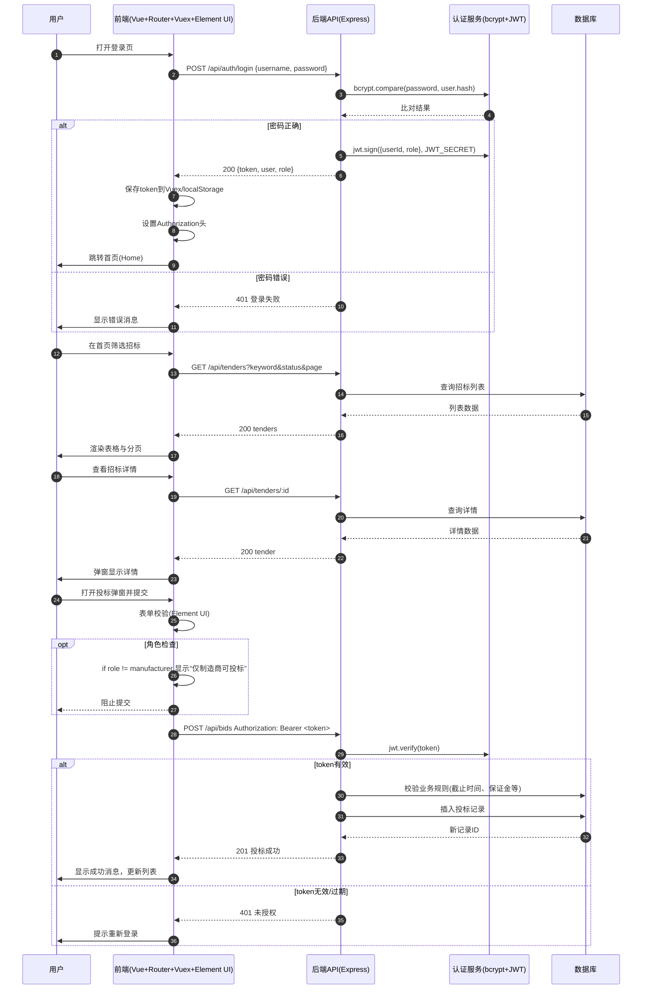

# 系统时序：登录到提交投标

下面用 Mermaid 时序图展示“用户从登录到提交投标”的端到端流程，体现前端（Vue + Router + Vuex + Element UI）、后端（Express）、认证（bcrypt + JWT）与数据库的协作。

```mermaid
sequenceDiagram
    autonumber
    participant U as 用户
    participant F as 前端(Vue+Router+Vuex+Element UI)
    participant A as 后端API(Express)
    participant Auth as 认证服务(bcrypt+JWT)
    participant DB as 数据库

    U->>F: 打开登录页
    F->>A: POST /api/auth/login {username, password}
    A->>Auth: bcrypt.compare(password, user.hash)
    Auth-->>A: 比对结果
    alt 密码正确
        A->>Auth: jwt.sign({userId, role}, JWT_SECRET)
        A-->>F: 200 {token, user, role}
        F->>F: 保存token到Vuex/localStorage
        F->>F: 设置Authorization头
        F->>U: 跳转首页(Home)
    else 密码错误
        A-->>F: 401 登录失败
        F->>U: 显示错误消息
    end

    U->>F: 在首页筛选招标
    F->>A: GET /api/tenders?keyword&status&page
    A->>DB: 查询招标列表
    DB-->>A: 列表数据
    A-->>F: 200 tenders
    F->>U: 渲染表格与分页

    U->>F: 查看招标详情
    F->>A: GET /api/tenders/:id
    A->>DB: 查询详情
    DB-->>A: 详情数据
    A-->>F: 200 tender
    F->>U: 弹窗显示详情

    U->>F: 打开投标弹窗并提交
    F->>F: 表单校验(Element UI)
    opt 角色检查
        F->>F: if role != manufacturer 显示“仅制造商可投标”
        F-->>U: 阻止提交
    end
    F->>A: POST /api/bids Authorization: Bearer <token>
    A->>Auth: jwt.verify(token)
    alt token有效
        A->>DB: 校验业务规则(截止时间、保证金等)
        A->>DB: 插入投标记录
        DB-->>A: 新记录ID
        A-->>F: 201 投标成功
        F->>U: 显示成功消息，更新列表
    else token无效/过期
        A-->>F: 401 未授权
        F->>U: 提示重新登录
    end
```

提示：你可以把此段 Mermaid 直接嵌入到《软件设计说明书》中，或在支持 Mermaid 的 Markdown 查看器中渲染查看。